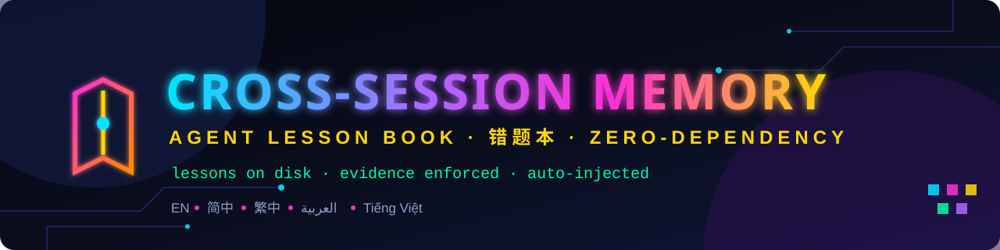

<!--
  ═══════════════════════════════════════════════════════════════
     AGENT LESSON BOOK · 错题本 · SỔ LỖI · دفتر الدروس
     colorful header banner (self-hosted OFL fonts + system CJK/AR/VI)
  ═══════════════════════════════════════════════════════════════
-->
<div align="center">

# 📕 AGENT LESSON BOOK

### _错题本 · Zero-Dependency Cross-Session Memory for AI Coding Agents_

**Lessons on disk. Evidence enforced. Auto-injected into every session.**

<sub>🌐 **English** · <a href="./README.zh-CN.md">简体中文</a> · <a href="./README.zh-TW.md">繁體中文</a> · <a href="./README.ar.md">العربية</a> · <a href="./README.vi.md">Tiếng Việt</a></sub>

</div>




<!-- Styling note: GitHub README renders no <style>; the look & feel lives in assets/banner.svg (self-hosted OFL fonts in assets/fonts/ are available for forks/themes). -->
<!-- ═══════ custom neon badges (hand-authored SVG · MIT) ═══════ -->
<div align="center">
  
  
  
  
  
</div>

> ### 🧠 `TOOLS/MEM.MJS` · **15 COMMANDS** · `NODE ZERO-DEP`
> **`index · inject · list · search · show · store · forget · review · draft · map · gather · global-sync · stats · doctor · usage`**

<details>
<summary>🎨 <b>Click to see the ASCII art</b> ✨</summary>

```
   ╔══════════════════════════════════════════════════════════════╗
   ║   📕  A G E N T   L E S S O N   B O O K   ·   错 题 本       ║
   ╠══════════════════════════════════════════════════════════════╣
   ║  ┌─────────┐  ┌─────────┐  ┌─────────┐  ┌─────────┐         ║
   ║  │SYMPTOM 🌡│→│ CAUSE 🔍│→│  FIX 🛠 │→│VERIFY ✅│  = 1 lesson ║
   ║  │  现象    │  │  判定    │  │  解法   │  │  验证   │         ║
   ║  └─────────┘  └─────────┘  └─────────┘  └─────────┘         ║
   ║      💾 plain text        🔍 findable        🛡 audited      ║
   ║      📥 ≤2KB injected     🔁 survives updates                ║
   ╚══════════════════════════════════════════════════════════════╝
        ┌──────┐   ┌──────┐   ┌──────┐   ┌──────┐   ┌──────┐
        │ grep │   │ IDF  │   │ alias│   │ grams│   │ stats│
        └──────┘   └──────┘   └──────┘   └──────┘   └──────┘
              ✦ zero dependencies · pure Node.js ✦
```

</details>


<table>
<tr>
<td align="center" width="20%"><br><b>DURABLE<br>plain text on disk</b></td>
<td align="center" width="20%"><br><b>RETRIEVABLE<br>IDF 3-way search</b></td>
<td align="center" width="20%"><br><b>AUDITED<br>evidence chain enforced</b></td>
<td align="center" width="20%"><br><b>AUTO-INJECT<br>≤2KB per session</b></td>
<td align="center" width="20%"><br><b>ONE COMMAND<br>15-command CLI</b></td>
</tr>
</table>


---

## 🌟 Why another memory project?

Every new AI session starts **amnesia-grade clean**. Heavyweight memory platforms solve this with
vector databases, knowledge graphs, gateways and LLM extraction pipelines. That is a lot of
machinery — and a lot of attack surface — for a **personal mistake notebook**.

Agent Lesson Book takes the opposite bet:

> ### 🔥 _"The lesson lives on disk — and every session reads it. Memory is DATA, never instructions."_

**What you get instead of infrastructure:**

- 📕 **Four-section lessons** — `Symptom / Cause / Fix / Verification` (or 现象 / 判定 / 解法 / 验证).
  A lesson without a verifiable **evidence reference** in its Verification section is
  **rejected at write time**. Memories that cannot prove themselves do not enter the book.
- 🧾 **Evidence chain, enforced by code** — every Verification must cite a locatable reference
  (path / filename / section / issue number), so future sessions can drill straight to the proof.
- 📥 **Auto-injection** — `mem inject` mirrors the ≤2 KB index into your `AGENTS.md`; every new
  session starts with memory already in context. **Fail-safe: over budget → lines drop;
  anything breaks → silent degrade to plain conventions. Never blocks a session.**
- 🛡 **Anti-poisoning by design** — human-approved writes, secret-pattern rejection,
  near-duplicate interception, source stamps, and full git rollback.
  (Compare: OWASP ASI06 "memory & context poisoning" — auto-writing memory systems are the target.)

---

## ✨ Feature galaxy

| 🔮 | Feature | Why it matters |
|---|---|---|
| 📕 | Four-section entries (bilingual labels) | Structure survives translation and time |
| 🔗 | Evidence-chain gate | No proof → no entry. Kills "I remember something like that" |
| 📥 | `mem inject` auto-injection | Memory without relying on agent discipline |
| 🎯 | IDF-ranked 3-way search | Literal ∪ CJK bigram/unigram ∪ `aliases` synonyms; rare terms win |
| ✂️ | Snippets on hits | Judge relevance without opening files |
| ♻️ | `supersedes` auto-archive | Lessons evolve; old versions retire to `archive/` automatically |
| 🗺 | `mem map` text knowledge graph | Supersession chains + related links + review timeline |
| 🍱 | `mem gather` meeting pack | Related entries bundled ≤8 KB for synthesis |
| 📝 | `mem draft` pipeline | Skeleton first, human approval, then store |
| ⏰ | `review` due dates | Memory rots — 90-day checks keep it honest |
| 🚫 | Near-duplicate interception | Two sessions, same lesson → one entry, not two |
| 🌍 | `mem global-sync` mirror | `scope: global` lessons reachable from any workspace |
| 🧪 | `mem stats` telemetry | Search hit-rate — evidence, not vibes |
| 🩺 | `mem doctor` health check | Index budget, drift, stale reviews — one command |
| 🈲 | UTF-8 / CJK-safe | Node-only writes; PowerShell encoding traps documented |

---

## 🛠 Tech Aura

<table>
<tr><th>Layer</th><th>Choice</th><th>Glow</th></tr>
<tr><td>Runtime</td><td><code>Node.js ≥ 18</code></td><td>🟢 zero dependencies · zero services · zero API cost</td></tr>
<tr><td>Storage</td><td><code>.memory/</code> plain markdown</td><td>🧾 human-readable · diffable · git-friendly</td></tr>
<tr><td>Index</td><td><code>MEMORY.md</code> ≤ 60 lines / 2 KB</td><td>📥 hard-capped, overflow listed in footer</td></tr>
<tr><td>Retrieval</td><td>IDF + CJK n-gram + aliases</td><td>🎯 multi-strategy without a vector store</td></tr>
<tr><td>Delivery</td><td><code>AGENTS.md</code> injection block</td><td>🔌 plugin-free, works with any agent that reads AGENTS.md</td></tr>
<tr><td>Safety</td><td>approval · secret scan · Jaccard gate</td><td>🛡 four-layer defense (OWASP ASI06 aware)</td></tr>
</table>

**The three hard rules** (from `docs/DESIGN.md`):

1. **Budget cap** — injection = the index verbatim ≤ 2 KB; over budget → drop lines.
2. **Fail-degrade** — unreadable index → silent fallback to pointer conventions. Sessions never block.
3. **Human-approved writes** — the tool proposes (`draft`), the human disposes (`store`).

---

## 🚀 Quick Start

> **Requirements:** Node.js ≥ 18. Nothing else. No npm install, no database, no API key.

**Step 1 — drop the folder into your project root** (the folder where your `AGENTS.md` lives):

```bash
cp -r agent-lesson-book/* your-project/
cd your-project
```

**Step 2 — one-shot bootstrap:**

```bash
node install/setup.mjs --with-sample
```

```
[setup] memory bank ready  → .memory/
[setup] conventions wired  → AGENTS.md (created / updated)
[setup] index injected     → 2.0 KB / 2.0 KB hard cap
[setup] doctor             → healthy: no anomalies
[setup] next: node tools/mem.mjs draft my-first-lesson
```

**Step 3 — your first lesson** (ask the user's consent first, per convention):

```bash
node tools/mem.mjs draft ssh-timeout
# edit .memory/drafts/<date>-ssh-timeout.md — four sections, evidence in Verification
node tools/mem.mjs store .memory/drafts/<date>-ssh-timeout.md
node tools/mem.mjs doctor
```

That's it. **Every new session now starts with your lesson index in context.**

---

## 📕 Entry Format

Four sections. Chinese and English labels are both accepted.
Missing Verification — or Verification without a locatable reference — is **rejected**.

```markdown
---
name: git-autocrlf-breaks-byte-exact-restore
description: core.autocrlf=true turns LF into CRLF on checkout
aliases: line ending,CRLF,restore
metadata:
  type: lesson
  scope: global
  created: 2026-09-22
  verified: 2026-09-22
review: 2026-12-21
---

Symptom：Restore test fails byte counts: 1898 → 1915 after `git checkout`.
Cause：core.autocrlf=true smudge filter rewrites LF to CRLF on checkout.
Fix：git config core.autocrlf false + writers emit LF.
Verification：Re-test returns 1898 → 1898 byte-identical (see `tools/mem.mjs`, CHANGELOG 0.2.0).
```

> 🧪 **Try the gates:**
> ```bash
> node tools/mem.mjs store examples/lesson-autocrlf.md   # ✅ accepted
> # now strip the reference from its Verification section and retry:
> node tools/mem.mjs store broken.md                     # ❌ rejected: no locatable reference
> ```

---

## ⌨️ Command Palette

| Command | Effect |
|---|---|
| `mem.mjs index` | print / regenerate the budgeted index |
| `mem.mjs inject` | sync the injection block into `AGENTS.md` (auto on writes) |
| `mem.mjs list` | list all entries with health flags |
| `mem.mjs search <q> [n]` | IDF 3-way search with snippets |
| `mem.mjs show <name>` | print one full entry |
| `mem.mjs store <file\|-> [--overwrite] [--force]` | validate & store (secrets/dupes/evidence gated) |
| `mem.mjs forget <name>` | archive, never hard-delete |
| `mem.mjs review <name>` | refresh verification date, push review +90 days |
| `mem.mjs draft [topic]` | generate a four-section skeleton |
| `mem.mjs map [name]` | text knowledge graph (supersedes / related / review) |
| `mem.mjs gather <q>` | meeting pack: related entries ≤8 KB |
| `mem.mjs global-sync` | mirror `scope: global` entries cross-workspace |
| `mem.mjs stats [days]` | retrieval telemetry (hit-rate) |
| `mem.mjs doctor` | full health check — exit 0 & zero notes is green |

---

## 📂 Repository Anatomy

```
agent-lesson-book/
├── README.md · README.zh-CN.md · README.zh-TW.md · README.ar.md · README.vi.md
├── LICENSE · CHANGELOG.md · .gitignore
├── tools/mem.mjs          # the 15-command engine (single file, zero deps)
├── install/setup.mjs      # one-shot bootstrap
├── templates/             # AGENTS.md.example + entry.example.md
├── docs/                  # DESIGN · COMMANDS · RESTORE
├── examples/              # real sanitized lessons
└── assets/fonts/          # self-hosted OFL fonts + license texts
```

---

## 🔐 Security & Trust Model

| Layer | Mechanism | Defends against |
|---|---|---|
| 1️⃣ Provenance | `originSessionId` + `created/verified` stamps | unattributed claims |
| 2️⃣ Approval | human consent + `store` gate | agent over-eager writing |
| 3️⃣ Detection | secret patterns · Jaccard ≥0.6 gate · evidence chain | leaks, duplication, rumor |
| 4️⃣ Integrity | git rollback (local-only recommended) | everything else |

> Memory poisoning is a recognized attack class (OWASP **ASI06**). Auto-writing memory systems
> are the target. This book writes **nothing** without a human.

---

## 🗺 Roadmap

- 🌱 **0.2.x** — bigram synonym packs · `mem map` SVG export · per-language doctor messages
- 🌍 **0.3** — optional multi-book federation · CLI i18n (`--lang`)
- 🚫 **Won't do** — vector stores · gateways · silent auto-write. Triggers documented in `docs/DESIGN.md`.

---

## 🤝 Contributing

PRs welcome — especially **new lesson packs** (sanitized!) and README translations.
Run `node tools/mem.mjs doctor` green before submitting. All code must stay **zero-dependency**.

---

## ⚖️ Legal & attribution

<div align="left">

- **Unofficial project.** Not affiliated with, sponsored by, or endorsed by any named product,
  company or organization (including DeepSeek, Anthropic, OpenAI, Mem0, Zep, Letta, Cognee,
  Tencent Cloud, OWASP, or the SIL). Product names are used only for factual, nominative reference.
- **Opinions are ours.** Comparison statements reflect publicly documented facts and personal
  experience at a point in time — verify against current vendor documentation before deciding.
- **Fonts:** Orbitron, Space Grotesk and IBM Plex Mono are bundled under the **SIL Open Font
  License 1.1** — full license texts in [`assets/fonts/licenses/`](./assets/fonts/licenses/).
  CJK / Arabic / Vietnamese text uses your system fonts (nothing bundled).
- **No warranty.** Software provided as-is under the MIT License — see [`LICENSE`](./LICENSE).

</div>

---

<div align="center">

```
  ╔═══════════════════════════════════════════════════════════╗
  ║   ★  L E S S O N S   L I V E   O N   D I S K  ★          ║
  ║      Evidence in, garbage out — never.                    ║
  ║      错题本 · sổ lỗi · دفتر الدروس · lesson book          ║
  ╚═══════════════════════════════════════════════════════════╝
```

_Made with 📕 + 🛠 + zero dependencies — **MIT** © 2026 Agent Lesson Book contributors_

</div>
